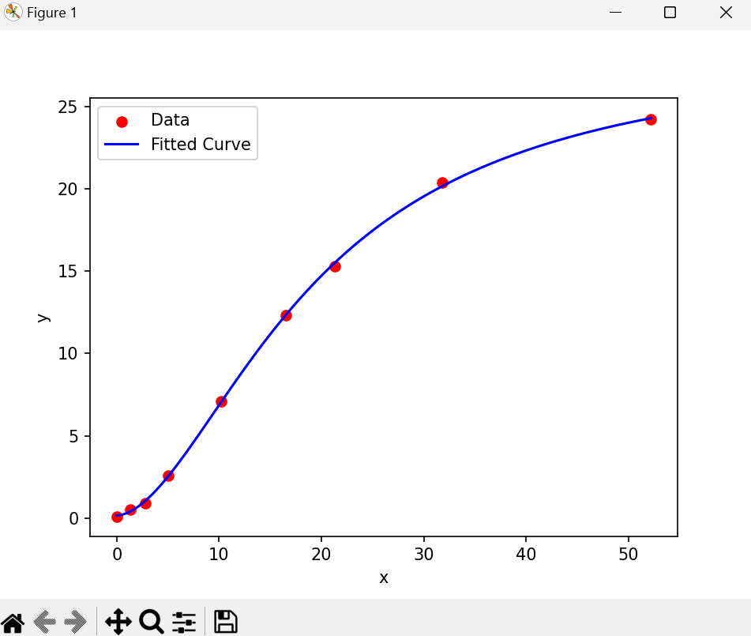

# Usage

Install the requrirements file:
```
pip install -r requirements.txt
```

Run the main file to make sure it is working:
```
python 4PL.py
```

Modify the 4PL.py main function with your own `concentration_array` and `response_array` or call it as a function as follows:

```
import 4PL

concentration_array = ... # Your values here
response_array = ... #Your values here

A_fit_final, B_fit_final, C_fit_final, D_fit_final, params_final, x_data_final, y_data_final, sse_final, rmse_final, r2_final, curve_direction_final = 4PL.calculate_coefficients(concentration_array, response_array)
```

# Format for the data
See the 4PL.py main function for examples of data structure (and expected resutlts)

Example output:
```text
Final curve direction: up
Final parameters: A = 0.153578, B = 1.771758, C = 19.349401, D = 28.447923
Goodness-of-fit measures: SSE = 0.157375, RMSE = 0.132235, R^2 = 0.999766
```



# About us
See our community science computation biology project here - https://sites.google.com/dmvpetridish.com/comp-bio